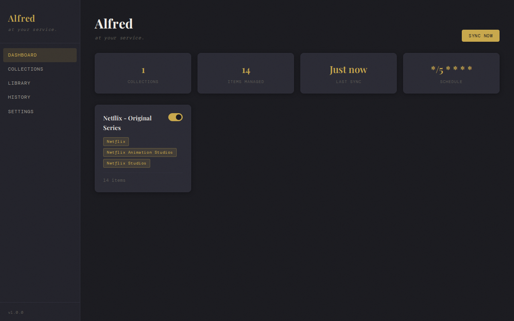
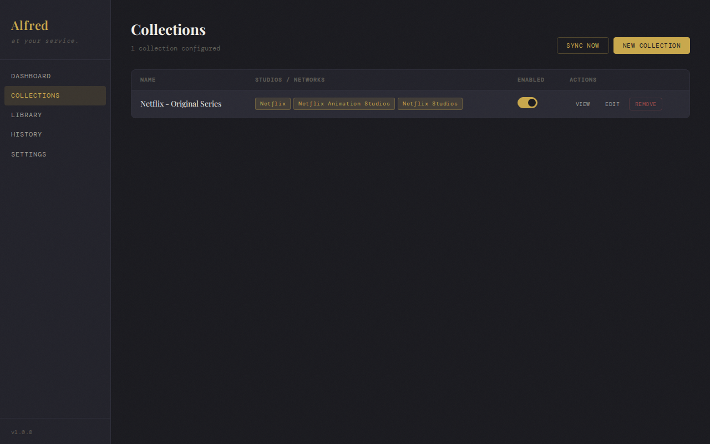
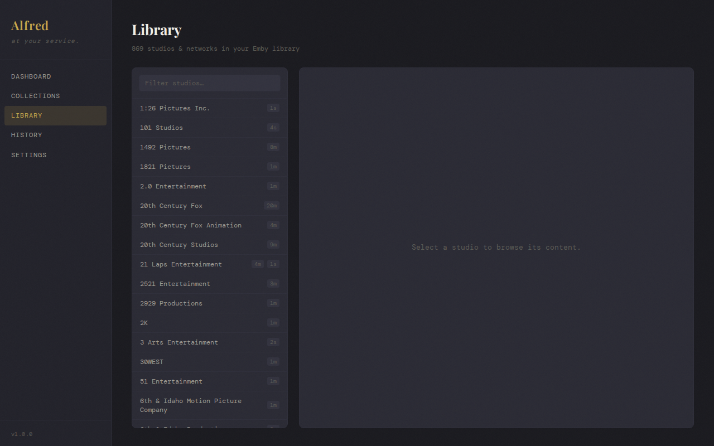
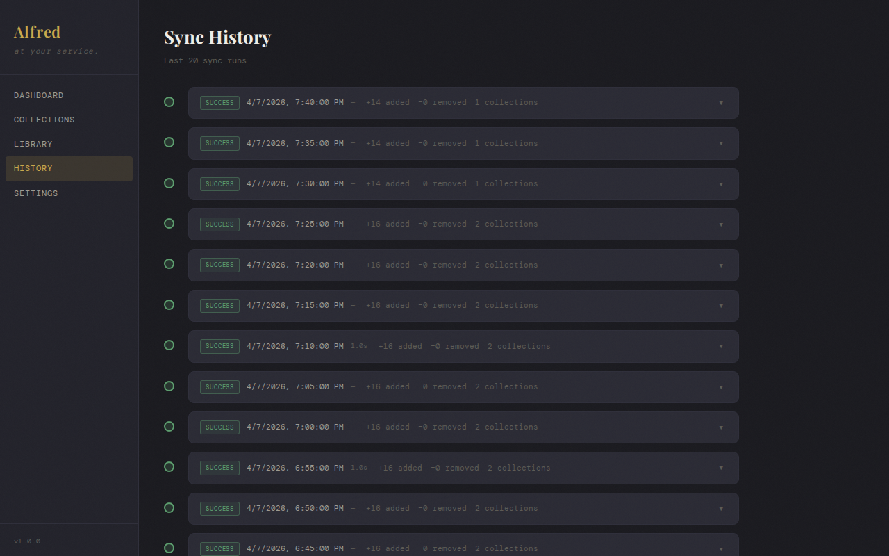
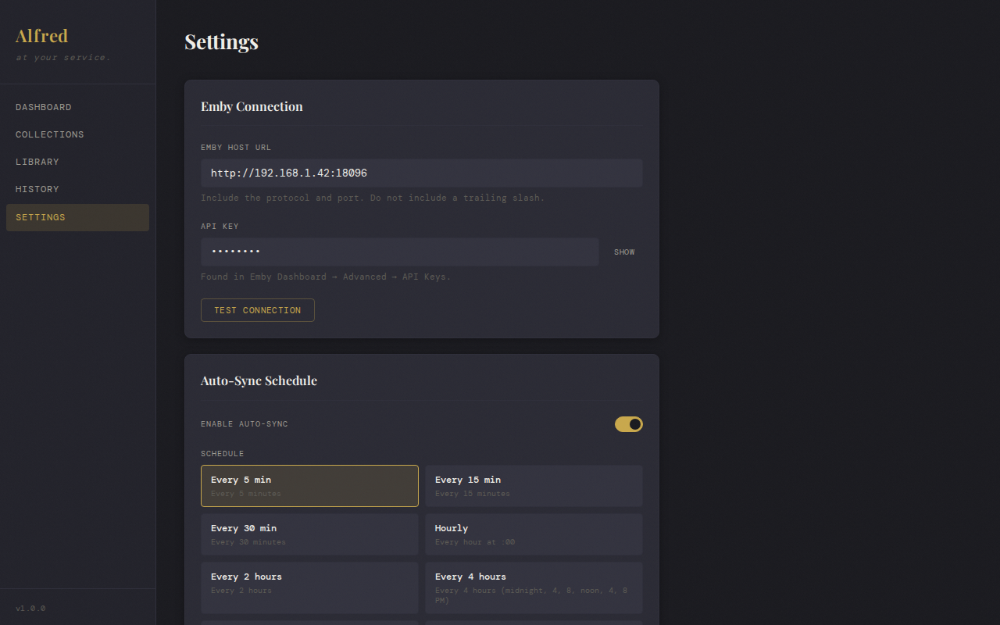

# Alfred

A self-hosted collection manager for [Emby](https://emby.media). Alfred automatically builds and maintains Emby collections based on rules you define — by studio, genre, tag, content type, or any combination — and keeps them in sync on a schedule.

## Features

- **Rule-based collections** — filter by studio (any, primary-only, or primary/secondary excluding streaming services), genre, tag, and content type
- **Scheduled sync** — cron-based sync with preset schedules or custom cron expressions
- **Manual sync** — trigger a sync on demand from the UI
- **Collection preview** — see exactly which items will be included before committing
- **Sync history** — per-collection results with item counts and error reporting
- **Single container** — React frontend + Express API + SQLite, all in one image

## Screenshots







## Requirements

- Docker (and optionally Docker Compose)
- A running Emby server with an API key

## Deployment

### Docker Compose (recommended)

```yaml
services:
  alfred:
    image: ghcr.io/grimothy/alfred:latest
    container_name: alfred
    ports:
      - "8099:8099"
    volumes:
      - /your/data/path:/app/data
      - /your/config/path:/app/config
    environment:
      - NODE_ENV=production
      - PORT=8099
      - DB_PATH=/app/data/alfred.db
    restart: unless-stopped
```

```bash
docker compose up -d
```

Then open `http://localhost:8099` and complete the setup wizard with your Emby host and API key.

### Docker CLI

```bash
docker run -d \
  --name alfred \
  -p 8099:8099 \
  -v /your/data/path:/app/data \
  -v /your/config/path:/app/config \
  -e NODE_ENV=production \
  ghcr.io/grimothy/alfred:latest
```

### Build from source

```bash
git clone https://github.com/Grimothy/alfred.git
cd alfred
npm install
npm run build
npm start
```

## Configuration

All configuration is done through the Settings page in the UI. There are no config files to edit.

| Setting | Description |
|---|---|
| Emby Host | Full URL to your Emby server (e.g. `http://192.168.1.10:8096`) |
| API Key | Emby API key from Dashboard → Advanced → API Keys |
| Sync Schedule | How often to sync collections (preset or custom cron) |
| Sync Enabled | Toggle scheduled sync on/off |

### Environment Variables

These are set at container level and are not configurable at runtime:

| Variable | Default | Description |
|---|---|---|
| `PORT` | `8099` | Port the server listens on |
| `DB_PATH` | `/app/data/alfred.db` | Path to the SQLite database file |
| `NODE_ENV` | `production` | Set to `development` to disable static file serving |

## Development

```bash
# Install dependencies
npm install

# Start both server and client with hot reload
npm run dev

# Type check
npm run typecheck
npx tsc -p tsconfig.server.json --noEmit
```

The Vite dev server proxies `/api` requests to the Express server on port `8099`.

## Tech Stack

- **Frontend** — React 18, Vite, TanStack Query, CSS Modules
- **Backend** — Node.js, Express, better-sqlite3
- **Scheduler** — node-cron
- **Container** — 3-stage Docker build (node:20-alpine)

## License

MIT
